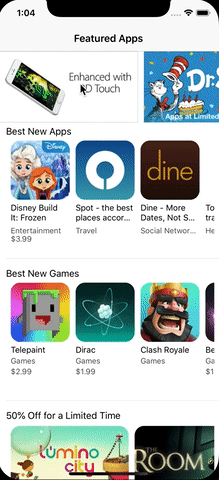

# AppStore
### Mock AppStore without Storyboard

Mock AppStore is result of [Let's Build That App](https://www.letsbuildthatapp.com/course/AppStore) course.

 

## Implementation

Mock AppStore has a NavigationController using CollectionView both built using only code without Storyboard.

The App make HTTP Requests using URLSession and JSONDecoder.
